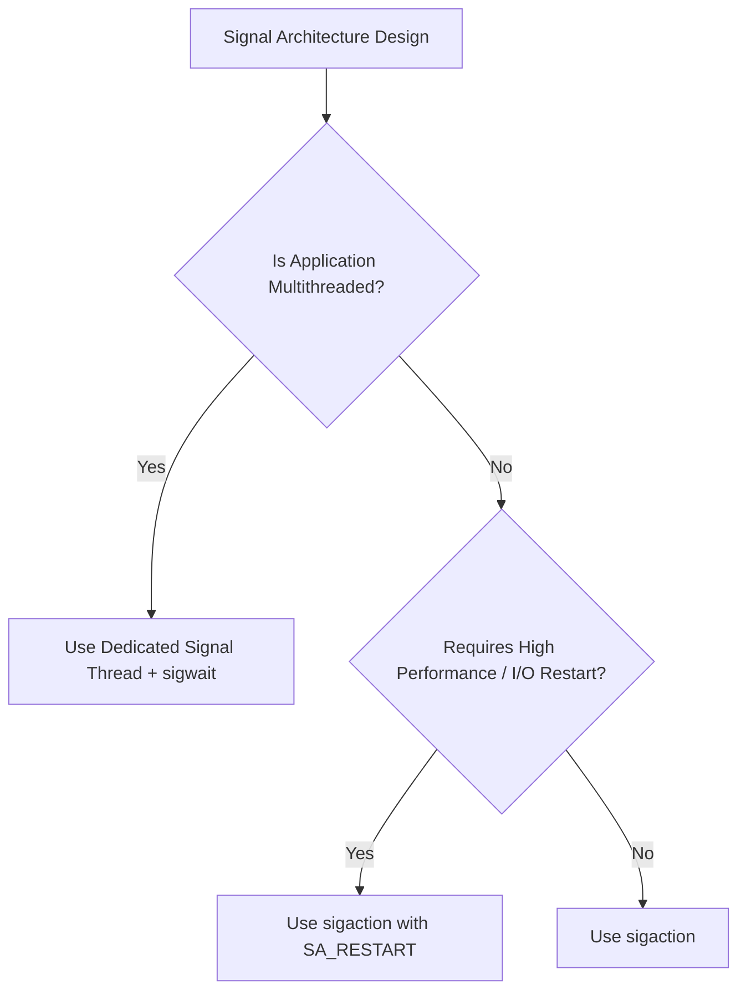

# POSIX Signals — Comprehensive Architecture & Multithreading Guide

> High-performance Linux systems programming guide covering signal lifecycle, thread delivery semantics, async-signal safety, and production synchronization patterns.

---

## Table of Contents
1. [What is a Signal?](#1-what-is-a-signal)
2. [Signal Disposition (Handler)](#2-signal-disposition-handler)
   - [2a. Signals That CANNOT Be Caught, Blocked, or Ignored](#2a-signals-that-cannot-be-caught-blocked-or-ignored)
   - [2b. Essential Linux Signals Taxonomy](#2b-essential-linux-signals-taxonomy)
3. [sigaction(): Why It Is Preferred](#3-sigaction-why-it-is-preferred)
4. [Signal Masking: Core Mechanics](#4-signal-masking-core-mechanics)
5. [Signal Mask: Per-Thread (Critical Rule)](#5-signal-mask-per-thread-critical-rule)
6. [APIs for Masking (sigprocmask vs pthread_sigmask)](#6-apis-for-masking-sigprocmask-vs-pthread_sigmask)
7. [Signal Delivery in Multithreaded Programs](#7-signal-delivery-in-multithreaded-programs)
8. [Thread Selection Clarification](#8-thread-selection-clarification)
9. [Masking During Handler Execution (sa_mask)](#9-masking-during-handler-execution-sa_mask)
10. [sa_flags: Behavior Modifiers](#10-sa_flags-behavior-modifiers)
11. [Async-Signal Safety (Critical System Concept)](#11-async-signal-safety-critical-system-concept)
12. [sigwait(): Synchronous Signal Handling](#12-sigwait-synchronous-signal-handling)
13. [Mandatory Rules for sigwait()](#13-mandatory-rules-for-sigwait)
14. [Correct sigwait() Design Pattern for Multithreading](#14-correct-sigwait-design-pattern-for-multithreading)
15. [Why sigwait() Does Not Use sigaction()](#15-why-sigwait-does-not-use-sigaction)
16. [Resolving Common Handler Misconceptions](#16-resolving-common-handler-misconceptions)
17. [Thread-Directed vs Process-Directed Signals](#17-thread-directed-vs-process-directed-signals)
18. [Final Mental Model and Rules of Thumb](#18-final-mental-model-and-rules-of-thumb)
19. [Decision Matrix: When to Use What](#19-decision-matrix-when-to-use-what)
20. [Executive Interview Summary](#20-executive-interview-summary)
21. [Real-Time Signals vs Standard Signals](#21-real-time-signals-vs-standard-signals)
22. [Signals Across fork() and execve()](#22-signals-across-fork-and-execve)
23. [Deep Dive: sigaction Flags and SA_SIGINFO](#23-deep-dive-sigaction-flags-and-sa_siginfo)
24. [Reentrancy and Deadlock Hazards in Signal Handlers](#24-reentrancy-and-deadlock-hazards-in-signal-handlers)

---

## 1. What is a Signal?

A **signal** is an asynchronous software interrupt generated by the Linux kernel to notify a process or a specific thread that an asynchronous system event has occurred.

### Common Examples
- **`SIGINT`** (Signal 2): Generated when the terminal driver detects `Ctrl+C`.
- **`SIGTERM`** (Signal 15): Polite termination request sent via `kill(pid, SIGTERM)`.
- **`SIGSEGV`** (Signal 11): Memory access violation detected by the MMU hardware.
- **`SIGCHLD`** (Signal 17): Generated when a child process terminates, stops, or continues.

### Core Architectural Properties
- **Asynchronous**: Can interrupt application execution between any two machine instructions.
- **User-Mode Delivery**: Executed in user space on the application's stack (or dedicated alternate signal stack `sigaltstack`).
- **Process Context**: Runs in the context of an existing thread within the process, **never** in kernel interrupt context.

---

## 2. Signal Disposition (Handler)

The **disposition** defines the action taken by the kernel when a signal is delivered to a process:
1. **Default Action (`SIG_DFL`)**: Kernel default (e.g. Terminate, Core Dump, Ignore, Stop).
2. **Ignore (`SIG_IGN`)**: Kernel silently discards the signal immediately upon generation.
3. **Custom Handler Function**: User-space function pointer invoked when the signal arrives.

> [!IMPORTANT]
> **Signal disposition is PROCESS-WIDE.**
> All threads within a process share the exact same signal disposition table. You **cannot** register a handler for Thread A and a different handler for Thread B.

Signal handlers are installed using:
- `signal()`: *Legacy, non-portable, and dangerous* (semantics vary across UNIX flavors).
- `sigaction()`: *POSIX-standard, atomic, robust, and strongly recommended*.

---

## 2a. Signals That CANNOT Be Caught, Blocked, or Ignored

> [!WARNING]
> In POSIX/Linux, two signals are hardwired directly into the kernel scheduler and **CANNOT be caught, blocked, or ignored**:
> 1. **`SIGKILL` (Signal 9)**: Unconditional, immediate process termination. The process cannot run any signal handlers, user-space destructors, or exit handlers.
> 2. **`SIGSTOP` (Signal 19)**: Unconditional process suspension (stops execution until `SIGCONT` is received).
> 
> Any attempt to register a handler or set a mask for `SIGKILL` or `SIGSTOP` via `sigaction()` or `pthread_sigmask()` will fail immediately with `-1` and `errno = EINVAL`.

---

## 2b. Essential Linux Signals Taxonomy

| Signal | Number | Default Action | Can Be Blocked/Caught? | Trigger Event & Architectural Purpose |
|---|:---:|:---:|:---:|---|
| **`SIGINT`** | 2 | Terminate | ✅ Yes | Generated by terminal on `Ctrl+C`. Polite request to stop an interactive program. |
| **`SIGQUIT`** | 3 | Terminate + Core | ✅ Yes | Generated by terminal on `Ctrl+\`. Used by developers to dump core and stack traces. |
| **`SIGKILL`** | 9 | Terminate | ❌ **NO** | Unconditional kernel kill. Process is destroyed without executing user code. |
| **`SIGSEGV`** | 11 | Terminate + Core | ✅ Yes | Segmentation fault: invalid virtual memory access, null pointer dereference. |
| **`SIGPIPE`** | 13 | Terminate | ✅ Yes | Writing to a socket, pipe, or FIFO with no open read ends. **Must ignore (`SIG_IGN`) in servers!** |
| **`SIGTERM`** | 15 | Terminate | ✅ Yes | Default termination signal sent by `kill(pid)` or `systemd` during shutdown. Allows graceful cleanup. |
| **`SIGCHLD`** | 17 | Ignore | ✅ Yes | Sent to parent when a child process terminates, stops, or continues. Parent must call `waitpid()`. |
| **`SIGSTOP`** | 19 | Stop | ❌ **NO** | Unconditional kernel suspension. |
| **`SIGTSTP`** | 20 | Stop | ✅ Yes | Interactive stop signal generated by terminal on `Ctrl+Z`. Handled by shells, `vi`, `less`. |

---

## 3. sigaction(): Why It Is Preferred

`sigaction()` atomically configures the complete signal handling contract without race conditions:
1. The handler function pointer (`sa_handler` or `sa_sigaction`).
2. The mask of signals blocked during handler execution (`sa_mask`).
3. Behavioral flags modifying kernel dispatch (`sa_flags`).

```cpp
#include <csignal>
#include <unistd.h>

void safe_signal_handler(int sig) {
    const char msg[] = "Received signal safely!\n";
    write(STDOUT_FILENO, msg, sizeof(msg) - 1);
}

void install_handler() {
    struct sigaction sa{};
    sa.sa_handler = safe_signal_handler;
    sigemptyset(&sa.sa_mask);
    sigaddset(&sa.sa_mask, SIGTERM); // Block SIGTERM while handling SIGINT
    sa.sa_flags = SA_RESTART;        // Automatically restart interrupted syscalls

    sigaction(SIGINT, &sa, nullptr);
}
```

---

## 4. Signal Masking: Core Mechanics

**Signal masking** is the process of temporarily blocking the kernel from delivering specific signals.

> [!IMPORTANT]
> **Masking blocks DELIVERY, not GENERATION.**
> If a blocked signal is generated, it is placed in the process/thread's **pending** set. It will be delivered the instant it is unmasked.

---

## 5. Signal Mask: Per-Thread (Critical Rule)

Unlike signal disposition (which is process-wide), **each thread possesses its own private signal mask**:

```
+-------------------------------------------------------------+
| Process (Shared Disposition: SIGINT -> handler())           |
|                                                             |
|  +------------------------+      +------------------------+ |
|  | Thread 1               |      | Thread 2               | |
|  | Mask: [SIGINT Blocked] |      | Mask: [SIGINT Allowed] | |
|  +------------------------+      +------------------------+ |
+-------------------------------------------------------------+
```

- Thread 1 blocks `SIGINT` $\to$ Kernel will **never** deliver `SIGINT` to Thread 1.
- Thread 2 does not block `SIGINT` $\to$ Kernel can deliver `SIGINT` to Thread 2.

---

## 6. APIs for Masking (sigprocmask vs pthread_sigmask)

| API | Concurrency Model | POSIX Standard Rule |
|---|---|---|
| `sigprocmask()` | **Single-threaded ONLY** | Undefined/unspecified behavior if invoked in a multithreaded process. |
| `pthread_sigmask()` | **Multithreaded C/C++** | Thread-safe; modifies the signal mask of the **calling thread only**. |

```cpp
#include <pthread.h>
#include <csignal>

sigset_t set;
sigemptyset(&set);
sigaddset(&set, SIGINT);
pthread_sigmask(SIG_BLOCK, &set, nullptr); // Blocks SIGINT for calling thread only
```

---

## 7. Signal Delivery in Multithreaded Programs

When a **process-directed signal** (such as `kill(pid, SIGINT)` or terminal `Ctrl+C`) arrives:
1. The kernel inspects all threads in the process.
2. It filters for threads that **do not have the signal blocked** in their signal mask.
3. It selects **exactly ONE eligible thread** (the selection algorithm is unspecified).
4. It redirects that thread's execution to the registered signal handler.

If all threads have the signal blocked, the signal remains **pending** at the process level until at least one thread unblocks it.

---

## 8. Thread Selection Clarification

> [!WARNING]
> **Common Fallacy**: "The kernel balances signal delivery across threads in round-robin fashion."
> **Reality**: The kernel makes **no fairness or round-robin guarantee**. The kernel may deliver consecutive signals to the exact same thread repeatedly.

---

## 9. Masking During Handler Execution (sa_mask)

When a signal handler is invoked:
- The kernel **automatically adds the signal being handled** to the active thread's signal mask (preventing self-interruption, unless `SA_NODEFER` is set).
- The kernel also adds all signals configured in `sa_mask`.

> [!NOTE]
> This automatic temporary mask applies **only to the thread executing the handler** and **only for the duration of the handler**. Other threads are completely unaffected.

---

## 10. sa_flags: Behavior Modifiers

- **`SA_RESTART`**: Automatically restarts interruptible system calls (`read()`, `write()`, `waitpid()`) if interrupted by this signal, preventing `EINTR`.
- **`SA_NODEFER`**: Disables automatic masking of the signal during handler execution.
- **`SA_RESETHAND`**: Resets disposition to `SIG_DFL` immediately upon entering the handler.
- **`SA_SIGINFO`**: Invokes `sa_sigaction` with 3 parameters (`sig`, `siginfo_t*`, `ucontext_t*`).

---

## 11. Async-Signal Safety (Critical System Concept)

> [!CAUTION]
> If a signal handler calls a non-async-signal-safe function while the interrupted code was executing that same function or holding internal locks, **deadlock or memory corruption is guaranteed**.

### Unsafe Operations in Signal Handlers
- `std::cout`, `printf`, `puts` (I/O buffering & internal locks)
- `malloc`, `free`, `new`, `delete` (global heap lock)
- `std::mutex`, `std::lock_guard`, `pthread_mutex_lock` (deadlock if interrupted thread holds it)
- `exit()` (runs `atexit` handlers and flushes stdio locks)

### Safe Operations in Signal Handlers
- `write()`, `read()` (POSIX low-level system calls)
- `_exit()`, `_Exit()` (direct kernel termination without user cleanup)
- Reading/writing `volatile std::sig_atomic_t`
- Lock-free `std::atomic<T>` (where `is_lock_free() == true`)

---

## 12. sigwait(): Synchronous Signal Handling

`sigwait()` converts asynchronous signal events into **synchronous procedural calls**:

```cpp
#include <csignal>

sigset_t set;
sigemptyset(&set);
sigaddset(&set, SIGINT);

int sig = 0;
sigwait(&set, &sig); // Blocks cleanly until SIGINT arrives, returns signal number
```

### Advantages
1. **Zero Async-Signal Safety Constraints**: Runs in normal thread context; you can safely use `std::cout`, `malloc`, `std::mutex`, and condition variables.
2. **Deterministic Control**: The thread decides exactly when and how to consume the signal.
3. **No Interrupted System Calls**: Worker threads never see `EINTR`.

---

## 13. Mandatory Rules for sigwait()

> [!IMPORTANT]
> The signals passed to `sigwait()` **MUST BE BLOCKED in the calling thread** before calling `sigwait()`.
> Furthermore, they **MUST BE BLOCKED in all other threads** in the process.

If not blocked:
- The kernel may deliver the signal to another thread via an asynchronous handler.
- `sigwait()` will remain suspended forever waiting for a signal that was already consumed.

---

## 14. Correct sigwait() Design Pattern for Multithreading

The industry-standard architecture for signal handling in C++ multithreaded servers:

```cpp
#include <iostream>
#include <thread>
#include <csignal>
#include <pthread.h>

void worker_thread() {
    // Inherits blocked signal mask from main thread!
    while (true) {
        // Safe from signal interruptions
    }
}

int main() {
    // 1. Block signals BEFORE creating any worker threads
    sigset_t set;
    sigemptyset(&set);
    sigaddset(&set, SIGINT);
    sigaddset(&set, SIGTERM);
    pthread_sigmask(SIG_BLOCK, &set, nullptr);

    // 2. Spawn worker threads (they inherit the blocked mask)
    std::thread worker(worker_thread);

    // 3. Spawn dedicated signal handling thread
    std::thread signal_thread([&set]() {
        int sig;
        sigwait(&set, &sig); // Synchronously awaits shutdown signal
        std::cout << "\nCaught signal " << sig << ", initiating clean shutdown...\n";
        // Perform thread-safe cleanup (locks, condition variables, joins)
    });

    signal_thread.join();
    worker.join();
    return 0;
}
```

---

## 15. Why sigwait() Does Not Use sigaction()

- `sigwait()` directly pulls pending signals from the kernel queue.
- It **does not invoke any signal handler**.
- Installing a `sigaction()` handler for a signal you intend to `sigwait()` is redundant and an anti-pattern.

---

## 16. Resolving Common Handler Misconceptions

| Misconception | Architectural Reality |
|---|---|
| *"If `sigwait()` catches the signal, who calls the handler?"* | **No handler is ever called.** `sigwait()` replaces handlers completely. |
| *"Each thread can install its own `SIGINT` handler."* | **False.** Handlers are process-wide. Only signal masks are per-thread. |
| *"Signals can be queued infinitely."* | **False for standard signals (1–31).** Pending standard signals are tracked via a single bit. |

---

## 17. Thread-Directed vs Process-Directed Signals

1. **Process-Directed Signals**:
   - Originate outside the process (e.g. `kill(pid, sig)`, terminal interrupts).
   - Delivered to any single thread whose mask has the signal unblocked.
2. **Thread-Directed Signals**:
   - Sent directly to a specific thread via `pthread_kill(thread_id, sig)` or generated by thread-specific hardware faults (`SIGSEGV`, `SIGFPE`, `SIGILL`).
   - Delivered **strictly to that targeted thread**.

---

## 18. Final Mental Model and Rules of Thumb

1. **Signal Disposition**: Process-wide.
2. **Signal Mask**: Per-thread.
3. **Signal Delivery**: Delivered to one eligible thread.
4. **sa_mask**: Active only on the executing thread during the handler call.
5. **sigwait()**: Synchronous, fully thread-safe, handler-free signal consumption.

---

## 19. Decision Matrix: When to Use What



---

## 20. Executive Interview Summary

> *"In multithreaded POSIX systems, signal dispositions are process-wide while signal masks are per-thread. Asynchronous signal handlers introduce severe reentrancy and deadlock risks due to non-async-signal-safe libraries. The gold-standard architecture is to block signals across all threads using `pthread_sigmask()` and delegate signal reception to a dedicated thread running `sigwait()`, turning asynchronous interrupts into clean synchronous workflow."*

---

## 21. Real-Time Signals vs Standard Signals

Linux supports two distinct signal classes:

| Feature | Standard Signals (1–31) | Real-Time Signals (32–64, `SIGRTMIN`–`SIGRTMAX`) |
|---|---|---|
| **Queueing** | **Not queued**. If multiple instances arrive while blocked, only one is recorded. | **Queued**. Every generated signal is preserved and delivered in order. |
| **Payload** | No data payload. | Can transmit payload via `union sigval` (`sigqueue`). |
| **Delivery Order** | Unspecified. | Deterministic: lower numeric values delivered first; FIFO for equal values. |
| **POSIX Interface** | `kill()`, `sigaction()` | `sigqueue()`, `sigwaitinfo()`, `sigtimedwait()` |

---

## 22. Signals Across fork() and execve()

### Behavior Across `fork()`
- Child inherits parent's signal dispositions (custom handlers, `SIG_IGN`, `SIG_DFL`).
- Child inherits parent's signal mask (`pthread_sigmask`).
- Child's pending signal set is **cleared**.

### Behavior Across `execve()`
- Custom handlers are **reset to `SIG_DFL`** (the old code no longer exists).
- Ignored signals (`SIG_IGN`) **remain `SIG_IGN`** in the newly loaded program image!
- Signal mask is **preserved** across `execve()`.
- Pending signals are **preserved** across `execve()`.

---

## 23. Deep Dive: sigaction Flags and SA_SIGINFO

When `sa_flags` includes `SA_SIGINFO`, the handler receives extended context:

```cpp
#include <csignal>
#include <unistd.h>

void detailed_handler(int sig, siginfo_t *info, void *ucontext) {
    // info->si_pid: PID of sending process
    // info->si_uid: UID of sending process
    // info->si_addr: Faulting memory address (for SIGSEGV/SIGBUS)
    // info->si_value: Integer/pointer passed via sigqueue()
}
```

---

## 24. Reentrancy and Deadlock Hazards in Signal Handlers

### The Heap Mutex Deadlock
```
Thread 1 (Application)                 Signal Arrives (SIGINT)
──────────────────────                 ───────────────────────
calls malloc()
  acquires heap_mutex ────────────► Interrupts Thread 1!
                                    runs handler()
                                      calls printf() -> calls malloc()
                                        attempts to acquire heap_mutex
                                        ==> DEADLOCK! <==
```

### Safety Rule
In asynchronous signal handlers:
1. Always preserve and restore `errno`:
   ```cpp
   int saved = errno;
   // perform async-signal-safe system calls (write, _exit)
   errno = saved;
   ```
2. For global flags, use `volatile std::sig_atomic_t` or lock-free `std::atomic<bool>`.
