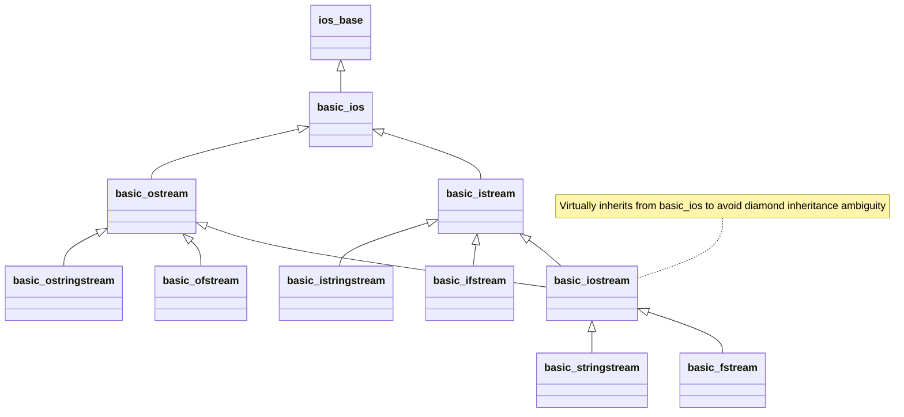

# Chapter 28: Input and Output

The C++ I/O stream library provides a flexible, type-safe, object-oriented framework for formatting, buffering, reading, and writing data across hardware devices, in-memory buffers, and persistent disk storage.

---

### Table of Contents
1. [Input and Output (I/O) Streams](#1--input-and-output-io-streams)
2. [Input with istream](#2--input-with-istream)
3. [Output with ostream and ios](#3--output-with-ostream-and-ios)
4. [Stream Classes for Strings](#4--stream-classes-for-strings)
5. [Stream States and Input Validation](#5--stream-states-and-input-validation)
6. [Basic File I/O](#6--basic-file-io)
7. [Random File I/O](#7--random-file-io)

---

## 1 — Input and Output (I/O) Streams

### The iostream Library
When you include the `<iostream>` header, you gain access to a whole hierarchy of classes responsible for providing I/O functionality (including one class that is actually named `iostream`).

The first thing we may notice about this hierarchy is that it uses **multiple inheritance** (that thing we told you to avoid if at all possible). However, the `iostream` library has been designed and extensively tested in order to avoid any of the typical multiple inheritance problems, so we can use it freely without worrying.



### Streams
At its most basic, I/O in C++ is implemented with **streams**. Abstractly, a stream is just a sequence of bytes that can be accessed sequentially. Over time, a stream may produce or consume potentially unlimited amounts of data.

- **Input streams**: Used to hold input from a data producer, such as a keyboard, a file, or a network socket. For example, the user may press a key on the keyboard while the program is currently not expecting any input. Rather than ignore the user's keypress, the data is placed into an input stream, where it will wait until the program is ready for it.
- **Output streams**: Used to hold output for a particular data consumer, such as a monitor, a file, or a printer. When writing data to an output device, the device may not be ready to accept that data yet — for example, the printer may still be warming up when the program writes data to its output stream. The data will sit in the output stream until the printer begins consuming it.
- Some devices, such as files and networks, are capable of being both input and output sources simultaneously.

### Input/Output in C++
- `ios` is a typedef for `std::basic_ios<char>` that defines fundamental state and formatting options common to both input and output streams.
- The `istream` class (`std::basic_istream<char>`) is the primary class used when dealing with input streams. With input streams, the **extraction operator** (`>>`) is used to remove values from the stream. This makes intuitive sense: when the user presses a key on the keyboard, the key code is placed in an input stream. Your program then extracts the value from the stream so it can be evaluated.
- The `ostream` class (`std::basic_ostream<char>`) is the primary class used when dealing with output streams. With output streams, the **insertion operator** (`<<`) is used to put values in the stream. This also makes intuitive sense: you insert your values into the stream, and the data consumer (e.g. monitor) consumes and displays them.
- The `iostream` class (`std::basic_iostream<char>`) can handle both input and output, allowing bidirectional I/O.

### Standard Streams in C++
A **standard stream** is a pre-connected stream provided to a computer program by its execution environment. C++ comes with four predefined standard stream objects that have already been set up for your use:
- `cin` — an `istream` object tied to standard input (typically the keyboard).
- `cout` — an `ostream` object tied to standard output (typically the monitor).
- `cerr` — an `ostream` object tied to standard error (typically the monitor), providing **unbuffered output**.
- `clog` — an `ostream` object tied to standard error (typically the monitor), providing **buffered output**.

> [!NOTE]
> Unbuffered output is typically handled immediately, whereas buffered output is stored in memory and written out as a block. Because `clog` isn't used very often, it is frequently omitted from high-level summaries of standard streams.

### Stream Synchronization and Tying

#### Synchronization with C Standard I/O (`sync_with_stdio`)
By default, C++ standard streams (`cin`, `cout`, `cerr`, `clog`) synchronize their underlying buffers with the standard C I/O buffers (`stdin`, `stdout`, `stderr`). This ensures that C++ stream operations and C stdio functions (like `printf`, `scanf`) can be safely mixed without interleaved output or input reordering.

However, this synchronization incurs noticeable performance overhead. If your program does not mix C stdio and C++ streams, you can disable synchronization to achieve significant performance gains:
```cpp
std::ios_base::sync_with_stdio(false);
```

> [!WARNING]
> Once `sync_with_stdio(false)` is executed, never mix C standard I/O (`printf`, `scanf`) with C++ streams (`cin`, `cout`), as their buffer synchronization is no longer guaranteed, leading to race conditions and out-of-order I/O.

#### Stream Tying (`cin.tie`)
By default, `std::cin` is "tied" to `std::cout` (and `std::wcin` to `std::wcout`). This means that any input operation on `std::cin` automatically flushes `std::cout` first. This guarantees that user prompts (printed via `cout`) appear on screen before the program waits for user input:
```cpp
std::cout << "Enter your age: "; // In output buffer
std::cin >> age;                 // Automatically flushes std::cout before waiting!
```

To untie `cin` from `cout` for maximum throughput (e.g. in competitive programming or bulk data processing):
```cpp
std::cin.tie(nullptr); // Disables automatic flushing before input
```

### 📁 Code Examples for Section 1
- [`28_1_Input_with_istream/3_stream_tie_and_sync.cpp`](file:///home/prashanth/Learnings/learncpp/OOPs/28_Input_and_Output/28_1_Input_with_istream/3_stream_tie_and_sync.cpp): Demonstrates how to query stream tying, decouple `cin` from `cout`, and disable C stdio synchronization for high-performance I/O.

---

## 2 — Input with istream

### Manipulators
A **manipulator** is an object used to modify a stream when applied with the extraction (`>>`) or insertion (`<<`) operators.
- An everyday example is `std::endl`, which inserts a newline character and flushes any buffered output.
- `std::setw` (defined in header `<iomanip>`) can be used to limit the number of characters read in from an input stream:

```cpp
#include <iomanip>
#include <iostream>

char buf[10]{};
std::cin >> std::setw(10) >> buf;
```

> [!NOTE]
> This program will only read the first 9 characters out of the stream (leaving room for a null terminator `'\0'`). Any remaining characters are left in the stream until the next extraction.

### Extraction (`>>`) and Whitespace
As a reminder, the extraction operator (`>>`) automatically skips whitespace (blanks, tabs, and newlines).

#### Single-Character Input: `get()`
The `get()` member function simply gets a character from the input stream. Unlike `operator>>`, `get()` can read whitespace characters directly:
```cpp
char ch{};
while (std::cin.get(ch)) {
    if (ch == '\n') break;
    std::cout << ch;
}
```

#### String Buffer Input: `get()`
`get()` also has an overloaded version that takes a character array buffer and a maximum character count:
```cpp
char strBuf[11]{};
std::cin.get(strBuf, 11);
std::cout << strBuf << '\n';
```

> [!NOTE]
> It only reads the first 10 characters (leaving one character for the null terminator). Any remaining characters are left in the input stream.

> [!WARNING]
> One critical nuance of `get()` is that it **does not extract or discard the newline character**! It reads up to the delimiter and stops.
> If you call `get()` again immediately, it will see the newline character as the very first character in the stream and stop immediately without reading new input.

```cpp
char strBuf[11]{};
std::cin.get(strBuf, 11);  // Reads up to newline, leaves '\n' in stream
std::cin.get(strBuf, 11);  // Sees '\n' immediately, reads 0 characters!
```

#### Discarding Delimiters: `getline()`
The `getline()` member function of `istream` works similarly to `get()`, but it **extracts and discards** the delimiter character from the stream:
```cpp
char buf[10]{};
std::cin.getline(buf, 10); // Extracts up to 9 chars, extracts and discards '\n'
```

#### Tracking Characters Extracted: `gcount()`
`gcount()` returns the number of unformatted characters extracted by the last unformatted input operation (such as `get()`, `getline()`, or `read()`):
```cpp
std::cout << "Characters extracted: " << std::cin.gcount() << '\n';
```

### Special Version of `getline()` for `std::string`
There is a dedicated, standalone version of `getline()` for reading `std::string` objects. This function is not a member of `istream` or `ostream`; it lives in the `std` namespace in the `<string>` header:
```cpp
#include <string>
#include <iostream>

std::string strBuf{};
std::getline(std::cin, strBuf); // Dynamically expands buffer, extracts & discards '\n'
std::cout << strBuf << '\n';
```

> [!TIP]
> Always prefer `std::getline(std::cin, str)` with `std::string` over fixed-size C-style buffers. `std::string` expands dynamically, preventing buffer overruns.

### A Few More Useful istream Functions
- `ignore()`: Discards the first character currently in the stream.
- `ignore(std::streamsize nCount)`: Discards the next `nCount` characters.
- `peek()`: Reads and returns the next character from the stream without removing it.
- `unget()`: Returns the last character extracted back into the stream so it can be re-read.
- `putback(char ch)`: Puts a character of your choice back into the stream to be read on the next extraction.

```cpp
char next = std::cin.peek(); // Inspect without extracting
std::cin.unget();            // Undo last get()
std::cin.putback('Z');       // Inject 'Z' as next readable character
```

### Robust Input Stream Recovery
When an extraction fails (e.g. entering letters when an integer is requested), `std::cin` enters a failed state (`failbit` is set) and leaves the bad input in the stream buffer. Subsequent extraction attempts are silently skipped.

To recover and re-prompt the user, you must perform two mandatory steps:
1. **Clear the error flags**: `std::cin.clear()`
2. **Flush the bad characters**: `std::cin.ignore(std::numeric_limits<std::streamsize>::max(), '\n')`

```cpp
#include <iostream>
#include <limits>

int value{};
while (true) {
    std::cout << "Enter an integer: ";
    if (std::cin >> value) {
        break; // Valid input extracted
    }
    // Recovery sequence:
    std::cin.clear(); // Reset failbit
    std::cin.ignore(std::numeric_limits<std::streamsize>::max(), '\n'); // Discard line
    std::cout << "Invalid input. Please try again.\n";
}
```

### 📁 Code Examples for Section 2
- [`28_1_Input_with_istream/1_input_with_stream.cpp`](file:///home/prashanth/Learnings/learncpp/OOPs/28_Input_and_Output/28_1_Input_with_istream/1_input_with_stream.cpp): Demonstrates `operator>>` with `std::setw`, character extraction with `get()`, buffer extraction with `get()` vs `getline()`, `gcount()`, and `std::getline()` with `std::string`.
- [`28_1_Input_with_istream/2_input_with_stream.cpp`](file:///home/prashanth/Learnings/learncpp/OOPs/28_Input_and_Output/28_1_Input_with_istream/2_input_with_stream.cpp): Demonstrates buffer manipulation using `ignore()`, `peek()` for non-destructive lookahead, `unget()`, and `putback()`.
- [`28_1_Input_with_istream/3_stream_tie_and_sync.cpp`](file:///home/prashanth/Learnings/learncpp/OOPs/28_Input_and_Output/28_1_Input_with_istream/3_stream_tie_and_sync.cpp): Demonstrates stream tying and stdio synchronization decoupling.

---

## 3 — Output with ostream and ios

### The Insertion Operator
Both `istream` and `ostream` are derived from the `ios` class. One of the primary responsibilities of `ios` (and its base `ios_base`) is controlling stream formatting options.

### Formatting Options
Stream formatting can be configured through two mechanisms:
1. **Flags**: Boolean variables within the stream that can be turned on or off.
2. **Manipulators**: Special objects placed directly into a stream expression that alter how items are formatted.

#### Flags
- To enable a flag, call `setf()` with the flag:
```cpp
std::cout.setf(std::ios::showpos); // Enable explicit + sign for positive numbers
std::cout << 27 << '\n';           // Outputs +27
```
- Multiple flags can be enabled simultaneously using bitwise OR (`|`):
```cpp
std::cout.setf(std::ios::showpos | std::ios::uppercase);
```
- To disable a flag, call `unsetf()`:
```cpp
std::cout.unsetf(std::ios::showpos);
```

#### Format Groups
Many flags belong to groups called **format groups**. A format group is a collection of flags that perform similar, often mutually exclusive formatting options (e.g. `basefield` controls octal, decimal, and hexadecimal bases).

> [!WARNING]
> Calling `setf(flag)` with a flag that belongs to a format group does **not** automatically disable mutually exclusive flags in that group!
> For example, calling `std::cout.setf(std::ios::hex)` fails to output hexadecimal because `std::ios::dec` is still set and takes precedence.
> To change flags in a format group safely, you must either unset the old flag first or use the two-argument version of `setf()`:
> ```cpp
> std::cout.setf(std::ios::hex, std::ios::basefield); // Clears basefield, sets hex
> ```

#### Manipulators
Manipulators are much easier to use than setting and unsetting flags because they are smart enough to automatically clear mutually exclusive flags in the same format group:
```cpp
std::cout << std::hex << 27 << '\n'; // Prints 1b in hex
std::cout << 28 << '\n';             // Still 1c in hex (state persists!)
std::cout << std::dec << 29 << '\n'; // Restores decimal
```

- Flags reside in the `std::ios` / `std::ios_base` class.
- Manipulators reside in the `std` namespace (`<iostream>` and `<iomanip>`).
- Formatting member functions reside in `std::ostream` / `std::ios_base`.

| Formatting Need | Flag | Manipulator | Meaning |
|---|---|---|---|
| **Booleans** | `std::ios::boolalpha` | `std::boolalpha`<br>`std::noboolalpha` | Prints `true`/`false` when enabled; `1`/`0` when disabled |
| **Positive Sign** | `std::ios::showpos` | `std::showpos`<br>`std::noshowpos` | Prefixes positive numbers with `+` |
| **Letter Case** | `std::ios::uppercase` | `std::uppercase`<br>`std::nouppercase` | Uses uppercase letters for hex digits (`0X`, `A`–`F`) and scientific `E` |

#### Basefield Format Group
| Group | Flag | Manipulator | Meaning |
|---|---|---|---|
| `std::ios::basefield` | `std::ios::dec` | `std::dec` | Prints integers in decimal (default) |
| `std::ios::basefield` | `std::ios::hex` | `std::hex` | Prints integers in hexadecimal |
| `std::ios::basefield` | `std::ios::oct` | `std::oct` | Prints integers in octal |

### Precision, Notation, and Decimal Points
| Group | Flag | Manipulator | Meaning |
|---|---|---|---|
| `std::ios::floatfield` | `std::ios::fixed` | `std::fixed` | Uses fixed decimal notation |
| `std::ios::floatfield` | `std::ios::scientific` | `std::scientific` | Uses scientific notation |
| `std::ios::floatfield` | (none) | `std::defaultfloat` (C++11) | Uses fixed for small values, scientific for large values |
| (independent) | `std::ios::showpoint` | `std::showpoint`<br>`std::noshowpoint` | Always shows decimal point and trailing zeros |
| `<iomanip>` | — | `std::setprecision(n)` | Sets precision to `n` digits |

| Member Function | Meaning |
|---|---|
| `std::ios_base::precision()` | Returns current floating-point precision |
| `std::ios_base::precision(int)` | Sets floating-point precision and returns previous precision |

> [!NOTE]
> If fixed or scientific notation is enabled, precision determines how many **decimal places in the fraction** are displayed. If precision is less than the number of significant digits, the value is rounded.
> If neither fixed nor scientific is enabled, precision determines the total number of **significant digits**.

```cpp
std::cout << std::fixed << std::setprecision(3) << 123.456;      // "123.456"
std::cout << std::scientific << std::setprecision(3) << 123.456; // "1.235e+02"
std::cout << std::defaultfloat << std::setprecision(3) << 123.456;// "123"
```

### Width, Fill Characters, and Justification
| Group | Flag | Manipulator | Meaning |
|---|---|---|---|
| `std::ios::adjustfield` | `std::ios::left` | `std::left` | Left-justifies sign and value |
| `std::ios::adjustfield` | `std::ios::right` | `std::right` | Right-justifies sign and value (default) |
| `std::ios::adjustfield` | `std::ios::internal` | `std::internal` | Left-justifies sign, right-justifies value |
| `<iomanip>` | — | `std::setw(int)` | Sets field width for next I/O operation |
| `<iomanip>` | — | `std::setfill(char)` | Sets character used to pad width |

```cpp
std::cout << std::setfill('*') << std::setw(10) << -12345 << '\n';               // "*****12345"
std::cout << std::setfill('*') << std::setw(10) << std::left << -12345 << '\n';  // "-12345****"
std::cout << std::setfill('*') << std::setw(10) << std::internal << -12345 << '\n'; // "-****12345"
```

> [!IMPORTANT]
> Unlike formatting flags and fill characters which are **stateful** (they persist until changed), `std::setw()` is **transient**: it applies only to the very next I/O field and then resets to 0.

### Modern C++ Alternatives: `std::format` (C++20) and `std::print` (C++23)
While `iostream` formatting is flexible and extensible for custom user types, it has well-known weaknesses:
1. **Stateful side-effects**: Manipulators permanently alter stream state until manually reversed, creating unexpected bugs across distant callsites.
2. **Verbosity**: Column formatting requires tedious chains of `setw`, `setfill`, and `setprecision`.
3. **Performance**: Virtual function calls and synchronization make streams slower than C `printf`.

- **C++20 `std::format`** (`<format>`): Provides Python-style, type-safe, non-stateful string formatting:
  ```cpp
  #include <format>
  std::string s = std::format("Hex: {:#04x}, Fixed: {:.2f}", 255, 3.14159);
  ```
- **C++23 `std::print` / `std::println`** (`<print>`): Direct formatted output to standard streams without intermediate heap allocation or `iostream` overhead:
  ```cpp
  #include <print>
  std::println("Hello, {:>10}! Answer: {:04d}", "world", 42);
  ```

### 📁 Code Examples for Section 3
- [`28_2_Output_with_ostream_n_ios/1_output_with_ostream_n_ios.cpp`](file:///home/prashanth/Learnings/learncpp/OOPs/28_Input_and_Output/28_2_Output_with_ostream_n_ios/1_output_with_ostream_n_ios.cpp): Demonstrates flags, format groups (`basefield`, `floatfield`, `adjustfield`), precision, padding characters, and width manipulators.

---

## 4 — Stream Classes for Strings

### Stream Classes
The stream classes for strings allow you to use familiar insertion (`<<`) and extraction (`>>`) operators to work with in-memory strings.
Like `istream` and `ostream`, string streams provide a buffer to hold data. However, unlike `cin` and `cout`, these streams are not connected to external hardware I/O channels. One of the primary uses of string streams is buffering output for display at a later time or processing input line-by-line.

There are six stream classes for strings (defined in header `<sstream>`):
- `istringstream` (derived from `istream`) — reading normal character strings.
- `ostringstream` (derived from `ostream`) — writing normal character strings.
- `stringstream` (derived from `iostream`) — reading and writing normal character strings.
- `wistringstream`, `wostringstream`, `wstringstream` — wide character string variants.

#### Populating and Reading a Stringstream
```cpp
#include <sstream>
#include <iostream>
#include <string>

std::stringstream os{};

// Getting data into a stringstream:
os << "12345 67.89"; // Insertion operator
os.str("en garde!"); // Setting internal buffer directly

// Getting data out of a stringstream:
std::string all = os.str(); // Returns copy of entire internal buffer

// Extracting formatted values:
std::stringstream ss{"12345 67.89"};
int num{};
double d{};
ss >> num >> d; // num = 12345, d = 67.89
```

> [!NOTE]
> The `>>` operator iterates through the string — each successive use of `>>` returns the next extractable token. On the other hand, `str()` returns the entire content of the stream buffer, even after extraction operations have consumed tokens.

### Conversions Between Strings and Numbers
String streams provide a straightforward mechanism to convert numeric types to strings and parse numbers from strings:

```cpp
// Number to string conversion:
std::stringstream ss{};
ss << 12345 << ' ' << 67.89;
std::string strVal1{}, strVal2{};
ss >> strVal1 >> strVal2;

// String to number conversion:
std::stringstream numStream{"12345 67.89"};
int nVal{};
double dVal{};
numStream >> nVal >> dVal;
```

### Clearing a Stringstream for Reuse
When reusing a string stream object across iterations, you must clear **both** the internal buffer and the stream state flags:

```cpp
os.str(""); // 1. Erase the buffer content
os.clear(); // 2. Reset stream error flags (eofbit, failbit)
```

> [!CAUTION]
> Calling `os.str("")` erases the buffer but does **not** reset stream state flags. If an extraction encountered EOF or a failure, `eofbit` or `failbit` will remain set, causing all subsequent insertions or extractions to silently fail until `os.clear()` is called!

### Modern C++ Stringstream Features (C++20)
- **Zero-Copy Buffer Inspection (`.view()`)**: In C++20, `std::stringstream` introduced the `.view()` member function. Instead of creating and copying into a new `std::string` (as `.str()` does), `.view()` returns a `std::string_view` referencing the internal buffer directly:
  ```cpp
  std::stringstream ss{};
  ss << "Result: " << 100;
  std::string_view sv = ss.view(); // C++20 zero-copy view!
  ```
- **Move Semantics**: String streams support move construction and move assignment, enabling efficient transfer of large buffered contents without unnecessary heap copies.

### 📁 Code Examples for Section 4
- [`28_3_Stream_classes_for_strings/1_string_stream.cpp`](file:///home/prashanth/Learnings/learncpp/OOPs/28_Input_and_Output/28_3_Stream_classes_for_strings/1_string_stream.cpp): Demonstrates populating, extracting, and converting string streams, as well as properly clearing buffers and state flags for reuse.

---

## 5 — Stream States and Input Validation

### Stream States
The `ios_base` class contains several state flags used to signal conditions that occur during stream operations:

| Flag | Meaning |
|---|---|
| `goodbit` | Everything is okay (numeric value 0) |
| `badbit` | A fatal unrecoverable error occurred (e.g. reading past EOF, stream corruption) |
| `eofbit` | The stream has reached the end of the file/input |
| `failbit` | A non-fatal error occurred (e.g. extracting alphabetic text into an integer) |

| Member Function | Meaning |
|---|---|
| `good()` | Returns `true` if `goodbit` is set (stream is completely error-free) |
| `bad()` | Returns `true` if `badbit` is set |
| `eof()` | Returns `true` if `eofbit` is set |
| `fail()` | Returns `true` if `failbit` OR `badbit` is set |
| `clear()` | Clears all error flags and restores stream to `goodbit` |
| `clear(state)` | Sets error flags directly to the specified `state` |
| `rdstate()` | Returns current set of state flags |
| `setstate(state)` | Sets the specified state flag (leaving existing flags intact) |

> [!IMPORTANT]
> If an error occurs and a stream enters any state other than `goodbit`, all further stream operations are ignored until `clear()` is explicitly called to reset the error state.

### Stream Boolean Conversion
Streams can be evaluated directly in boolean conditional contexts:
```cpp
if (std::cin) { /* Stream is good */ }
while (std::cin >> x) { /* Successfully extracted x */ }
```

- **Pre-C++11**: Streams defined an implicit conversion operator to `void*` (`operator void*()`) to allow conditional checks while preventing accidental conversions to arithmetic types.
- **C++11 and Newer**: Streams provide an `explicit operator bool()` returning `!fail()`. A stream evaluates to `true` if neither `failbit` nor `badbit` is set.
- `operator!` returns `fail()`, evaluating to `true` if an error occurred.

### Input Validation
Input validation is the process of verifying that user input conforms to expected criteria. It generally falls into two categories:
1. **String validation**: Inspecting character properties (e.g. checking if an entered name contains only letters).
2. **Numeric validation**: Verifying numeric formats and acceptable numerical ranges.

#### Character Classification (`<cctype>`)
C++ provides standard character inspection functions in `<cctype>`:

| Function | Meaning |
|---|---|
| `std::isalnum(int)` | Returns non-zero if alphanumeric (letter or digit) |
| `std::isalpha(int)` | Returns non-zero if alphabetic letter |
| `std::iscntrl(int)` | Returns non-zero if control character |
| `std::isdigit(int)` | Returns non-zero if decimal digit (`0`–`9`) |
| `std::isgraph(int)` | Returns non-zero if printable and not whitespace |
| `std::isprint(int)` | Returns non-zero if printable (including space) |
| `std::ispunct(int)` | Returns non-zero if punctuation (not alphanumeric, not space) |
| `std::isspace(int)` | Returns non-zero if whitespace (space, tab, newline, etc.) |
| `std::isxdigit(int)` | Returns non-zero if hexadecimal digit (`0`–`9`, `a`–`f`, `A`–`F`) |

#### String Validation with `std::all_of`
When validating variable-length input strings, `std::all_of` (from `<algorithm>`) offers an elegant approach:
```cpp
#include <algorithm>
#include <cctype>
#include <string>

bool isValidName(const std::string& name) {
    return !name.empty() && std::all_of(name.begin(), name.end(), [](unsigned char c) {
        return std::isalpha(c) || std::isspace(c);
    });
}
```

#### Numeric Validation Loop
```cpp
#include <iostream>
#include <limits>

double getDoubleInput() {
    double value{};
    while (true) {
        std::cout << "Enter a positive number: ";
        if (std::cin >> value && value > 0.0) {
            return value;
        }
        std::cin.clear();
        std::cin.ignore(std::numeric_limits<std::streamsize>::max(), '\n');
        std::cout << "Invalid entry. Try again.\n";
    }
}
```

### 📁 Code Examples for Section 5
- [`28_4_Stream_states_n_input_validation/1_string_input_validation.cpp`](file:///home/prashanth/Learnings/learncpp/OOPs/28_Input_and_Output/28_4_Stream_states_n_input_validation/1_string_input_validation.cpp): Demonstrates string validation using character classifications and `std::all_of`.
- [`28_4_Stream_states_n_input_validation/2_numeric_input_validation.cpp`](file:///home/prashanth/Learnings/learncpp/OOPs/28_Input_and_Output/28_4_Stream_states_n_input_validation/2_numeric_input_validation.cpp): Demonstrates validating numeric inputs via string inspection.
- [`28_4_Stream_states_n_input_validation/3_numeric_input_validation_with_extraction.cpp`](file:///home/prashanth/Learnings/learncpp/OOPs/28_Input_and_Output/28_4_Stream_states_n_input_validation/3_numeric_input_validation_with_extraction.cpp): Demonstrates checking `failbit`, recovering with `clear()`, and flushing leftover characters with `ignore()`.

---

## 6 — Basic File I/O

File I/O in C++ works similarly to console I/O, with three primary file stream classes defined in header `<fstream>`:
- `ifstream` (derived from `istream`) — reading from files.
- `ofstream` (derived from `ostream`) — writing to files.
- `fstream` (derived from `iostream`) — reading and writing to files.

Unlike `cin` and `cout` which are pre-connected, file streams must be explicitly configured and opened by the programmer.

### File Opening, Closing, and RAII
To open a file, instantiate the file stream with the filename. Once done, you can close the file in two ways:
1. Explicitly call `.close()`
2. Allow the file stream object to go out of scope: its destructor automatically flushes and closes the file (**RAII**).

```cpp
#include <fstream>
#include <iostream>

{
    std::ofstream out{ "Sample.txt" };
    out << "Writing line 1\n";
    out.put('A');
} // out goes out of scope here: destructor flushes and closes Sample.txt
```

### Buffered Output and Flushing
File streams use internal memory buffers for performance. Data written to an `ofstream` is not immediately written to disk.
- **Flushing**: Occurs automatically when the buffer fills, when the file is closed, or via explicit calls to `.flush()` or manipulator `std::flush`.
- **Risk**: If a program terminates abruptly (via crash or `std::exit()`), buffered output may not be flushed, resulting in silent data loss.
- **Best Practice**: Prefer `'\n'` over `std::endl` to avoid unnecessary flushing; call `.close()` or `.flush()` explicitly before exit if durability verification is needed.

### File Modes
When opening files, access modes can be specified using `std::ios` mode flags:

| Mode Flag | Meaning |
|---|---|
| `std::ios::app` | Appends all output to the end of the file |
| `std::ios::ate` | "At the end": Seeks to the end of the file immediately upon opening |
| `std::ios::binary` | Opens in binary mode (suppresses newline conversions) |
| `std::ios::in` | Opens for reading (default for `ifstream`) |
| `std::ios::out` | Opens for writing (default for `ofstream`) |
| `std::ios::trunc` | Truncates (erases) file contents if it already exists |

Flags can be combined using the bitwise OR (`|`) operator:
```cpp
std::ofstream out{ "log.txt", std::ios::out | std::ios::app };
```

> [!TIP]
> Opening an `fstream` with `std::ios::in | std::ios::out` will fail if the target file does not already exist. To create a new file if missing, open initially with `std::ios::out`.

### Filesystem Path Support (C++17)
Since C++17, all file stream constructors and `open()` methods accept `std::filesystem::path` objects directly (`#include <filesystem>`). This provides portable, native Unicode and cross-platform directory path management:
```cpp
#include <filesystem>
#include <fstream>

std::filesystem::path p{ "records/user.dat" };
std::ofstream out{ p, std::ios::binary };
```

### Binary File I/O with `read()` and `write()`
In addition to formatted text I/O with `<<` and `>>`, file streams support raw, unformatted binary I/O:
- `ostream::write(const char* s, std::streamsize n)`: Writes `n` raw bytes from memory buffer `s` to disk.
- `istream::read(char* s, std::streamsize n)`: Reads up to `n` raw bytes from disk into memory buffer `s`.

```cpp
struct Record {
    int id;
    double score;
};

// Writing binary data:
Record r1{ 42, 98.6 };
out.write(reinterpret_cast<const char*>(&r1), sizeof(Record));

// Reading binary data:
Record r2{};
in.read(reinterpret_cast<char*>(&r2), sizeof(Record));
std::streamsize bytesRead = in.gcount(); // Number of bytes read
```

> [!WARNING]
> Only **trivially copyable** types (primitives, plain old data structs) may be safely written to or read from disk with `read()` and `write()`.
> Never write objects containing pointers, dynamic memory (`std::string`, `std::vector`), or virtual method tables (polymorphic classes). Pointers stored to disk point to addresses that will be invalid upon reading back into memory!

### 📁 Code Examples for Section 6
- [`28_5_Basic_file_I_O/1_basic_output.cpp`](file:///home/prashanth/Learnings/learncpp/OOPs/28_Input_and_Output/28_5_Basic_file_I_O/1_basic_output.cpp): Demonstrates basic file output with `std::ofstream`.
- [`28_5_Basic_file_I_O/2_basic_input.cpp`](file:///home/prashanth/Learnings/learncpp/OOPs/28_Input_and_Output/28_5_Basic_file_I_O/2_basic_input.cpp): Demonstrates sequential file input using `std::ifstream`.
- [`28_5_Basic_file_I_O/3_append_mode_output.cpp`](file:///home/prashanth/Learnings/learncpp/OOPs/28_Input_and_Output/28_5_Basic_file_I_O/3_append_mode_output.cpp): Demonstrates appending records using `std::ios::app`.
- [`28_5_Basic_file_I_O/4_append_mode_input.cpp`](file:///home/prashanth/Learnings/learncpp/OOPs/28_Input_and_Output/28_5_Basic_file_I_O/4_append_mode_input.cpp): Demonstrates reading appended file content.
- [`28_5_Basic_file_I_O/5_binary_file_io.cpp`](file:///home/prashanth/Learnings/learncpp/OOPs/28_Input_and_Output/28_5_Basic_file_I_O/5_binary_file_io.cpp): Demonstrates binary read/write operations using `write()`, `read()`, `gcount()`, and trivially-copyable static assertions.

---

## 7 — Random File I/O

### The File Pointer
Each stream maintains an internal **file pointer** tracking the current read/write position. All reads and writes take place at this position. When a file is opened normally, the pointer begins at byte 0. If opened in `std::ios::app` mode, the pointer is positioned at the end of the file.

### Random Access with `seekg()` and `seekp()`
Rather than reading a file sequentially from start to finish, random access lets you jump directly to arbitrary positions:
- `seekg()` ("seek get"): Changes the read position for input streams.
- `seekp()` ("seek put"): Changes the write position for output streams.

> [!NOTE]
> In file streams (`fstream`), the read and write positions share the same underlying file offset, so `seekg()` and `seekp()` work interchangeably.

Both functions accept:
1. An **offset** in bytes (positive moves forward, negative moves backward).
2. A **seek direction flag**:

| Flag | Meaning |
|---|---|
| `std::ios::beg` | Offset relative to the beginning of the file (default) |
| `std::ios::cur` | Offset relative to current file pointer position |
| `std::ios::end` | Offset relative to the end of the file |

```cpp
inf.seekg(14, std::ios::beg);  // Move to 14th byte from start
inf.seekg(-10, std::ios::end); // Move to 10 bytes before end
inf.seekg(5, std::ios::cur);   // Move forward 5 bytes from current position
```

> [!WARNING]
> Seeking to arbitrary byte positions in **text files** is unpredictable across platforms due to differing newline encodings:
> - Windows: `CR` + `LF` (2 bytes)
> - Linux / Unix: `LF` (1 byte)
> Moving forward or backward by a set byte offset may land directly inside a multi-byte newline sequence.
> Additionally, some file systems pad files with trailing zeros. For reliable, byte-exact seeking, **always open files in binary mode (`std::ios::binary`)**.

### Determining File Size with `tellg()` and `tellp()`
The `tellg()` and `tellp()` functions return the current absolute position of the file pointer (as `std::streampos`):
```cpp
std::ifstream inf{ "Sample.dat", std::ios::binary };
inf.seekg(0, std::ios::end); // Seek to end
std::streampos fileSize = inf.tellg(); // Query file size in bytes
```

### Reading and Writing Simultaneously with `fstream`
The `fstream` class can perform both read and write operations on the same file. However, there is an essential constraint:
> [!CAUTION]
> You cannot switch between reading and writing arbitrarily without an intervening file positioning operation (a seek).
> Once a read has occurred, you must call a seek function before writing. Once a write has occurred, you must call a seek function before reading.

If you already want to read/write at the current position, seek to the current position explicitly:
```cpp
iofile.seekg(iofile.tellg(), std::ios::beg); // Required sync operation!
```
Without this explicit seek, subsequent read or write operations can produce undefined, corrupted behavior.

> [!NOTE]
> Unlike `ifstream` where `while (inf)` reliably loops until EOF, using `while (iofile)` does not work similarly for simultaneous bidirectional `fstream` operations because reaching EOF on a read flags the stream as invalid, preventing subsequent writes until `clear()` is invoked.

### Other Useful File Functions
- `std::remove(const char* filename)`: Deletes a file from disk (`<cstdio>`).
- `.is_open()`: Returns `true` if the file stream is currently associated with an open file.

### Warning About Writing Pointers to Disk
Never write memory addresses (pointers) to persistent storage. Pointers represent temporary virtual memory locations for a specific process run. When read back in from disk in a subsequent run, those addresses will no longer be valid, resulting in memory corruption and segmentation faults.

### 📁 Code Examples for Section 7
- [`28_6_Random_file_I_O/1_random_file_seek.cpp`](file:///home/prashanth/Learnings/learncpp/OOPs/28_Input_and_Output/28_6_Random_file_I_O/1_random_file_seek.cpp): Demonstrates seeking positions using `seekg()`, `seekp()`, and calculating positions with `tellg()`/`tellp()`.
- [`28_6_Random_file_I_O/2_fstream_example.cpp`](file:///home/prashanth/Learnings/learncpp/OOPs/28_Input_and_Output/28_6_Random_file_I_O/2_fstream_example.cpp): Demonstrates simultaneous read/write file access using `std::fstream` and mandatory seek synchronization.
