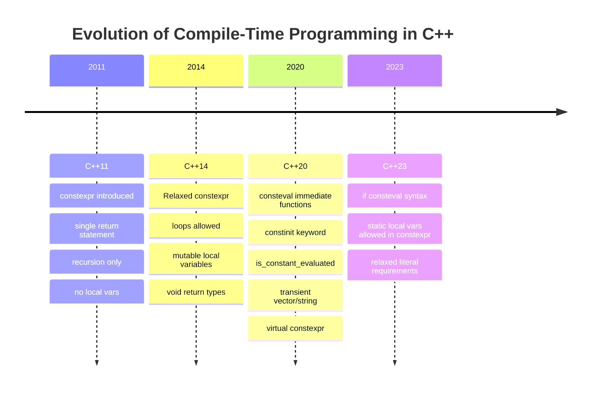

# Chapter F: Constexpr and Consteval Functions

The `constexpr` and `consteval` language features allow developers to shift computational workloads from runtime to compile-time, delivering zero-cost abstractions, guaranteed constant expressions, and enhanced type safety.

---

### Table of Contents
1. [Constexpr Functions](#1--constexpr-functions)
2. [Forcing a Constexpr Function to Evaluate at Compile-Time (Consteval)](#2--forcing-a-constexpr-function-to-evaluate-at-compile-time-consteval)
3. [Constinit and Compile-Time Variable Initialization (C++20)](#3--constinit-and-compile-time-variable-initialization-c20)
4. [Evolution of Constexpr Across C++ Standards](#4--evolution-of-constexpr-across-c-standards)

---

## 1 — Constexpr Functions

### The `constexpr` Keyword and Constant Expressions
- The **`constexpr`** keyword is used to create compile-time (symbolic) constants.
- **Constant expressions** are expressions that can be fully evaluated at compile-time by the compiler rather than deferred to runtime.

### Challenge with Constant Expressions
The primary challenge with constant expressions is that function calls to normal (non-constexpr) functions are **not allowed** inside constant expressions:
```cpp
int getValue() { return 5; }

int main() {
    constexpr int x = getValue(); // COMPILE ERROR: getValue() cannot be called in constant expression
}
```

### Constexpr Functions
A **constexpr function** is a function that can be used inside constant expressions:
- If a required constant expression contains a constexpr function call, that constexpr function call **must evaluate at compile-time**.
- When a function call is evaluated at compile-time, the compiler calculates the return value of the function call during compilation and replaces the function call with the resulting constant literal.

#### Mandatory Conditions for Compile-Time Evaluation
To evaluate at compile-time, the following conditions must all be satisfied:
1. The call to the constexpr function must have arguments that are known at compile-time (i.e. are constant expressions).
2. All statements and expressions within the constexpr function must be evaluatable at compile-time.
3. When a constexpr (or consteval) function is being evaluated at compile-time, any other functions it calls are required to be evaluated at compile-time (otherwise the initial function would not be able to return a result at compile-time).

```cpp
constexpr int add(int x, int y) {
    return x + y;
}

int main() {
    constexpr int sum = add(5, 6); // Evaluated at compile-time! Replaced with 11.
}
```

> [!NOTE]
> Constexpr functions can also be evaluated at **runtime**. In such cases (when invoked with non-constant arguments or in runtime contexts), the function behaves and executes just like a normal function.

### Constexpr/Consteval Function Parameters are NOT Constexpr
A common beginner misconception is assuming function parameters of a constexpr function are themselves `constexpr`.
- A `constexpr` function parameter would imply that the function could only ever be called with constant arguments. But this is not the case: constexpr functions can be called with runtime arguments.
- Because parameters are **not constexpr**, they **cannot be used in constant expressions within the function** (e.g. to initialize a `constexpr` local variable or specify an array size).
- The parameters of constexpr functions may be declared as `const`, in which case they are treated as standard runtime constants.

```cpp
constexpr int process(int val) {
    // constexpr int v2 = val; // COMPILE ERROR: 'val' is not a constant expression!
    const int v2 = val;        // OK: standard runtime const
    return v2 * 2;
}
```

### Constexpr Functions are Implicitly Inline
- The compiler must be able to see the **full definition** of a constexpr (or consteval) function at the point of invocation, not just a forward declaration.
- For this reason, constexpr functions are **implicitly inline**.
- Constexpr/consteval functions used in multiple source files should be defined in **header files** so their definitions can be included directly into each translation unit.
- For constexpr function calls that are only evaluated at runtime, a forward declaration is technically sufficient to satisfy the linker. This means you can use a forward declaration to call a constexpr function defined in another translation unit, but **only if** you invoke it in a context that does not require compile-time evaluation.

### Recap
- Marking a function as `constexpr` means it **can** be used in a constant expression. It does **not** mean it *will* evaluate at compile-time in all contexts.
- A constant expression (which may contain constexpr function calls) is only required to evaluate at compile-time in contexts where a constant expression is **required** (e.g. `constexpr` variable initializers, template arguments, fixed array lengths).
- In contexts that do not require a constant expression, the compiler may choose whether to evaluate a constant expression at compile-time or runtime.
- A runtime (non-constant) expression will evaluate at runtime.
- Even non-constexpr functions could theoretically be evaluated at compile-time by the compiler under the **as-if rule** as an optimization.

### Key Insight: Spectrum of Evaluation Likelihood
We can categorize the likelihood that a function will actually be evaluated at compile-time as follows:

| Likelihood | Scenario |
|---|---|
| **Always** *(required by C++ standard)* | • Constexpr function is called where a constant expression is required.<br>• Constexpr function is called from another function currently being evaluated at compile-time. |
| **Probably** *(compiler optimization)* | • Constexpr function is called where a constant expression isn’t required, but all arguments are constant expressions. |
| **Possibly** *(under as-if rule)* | • Constexpr function is called where constant expression isn’t required, some arguments are not constant expressions but their values are known at compile-time.<br>• Non-constexpr function capable of compile-time evaluation with constant arguments. |
| **Never** *(impossible)* | • Constexpr function is called where a constant expression isn’t required, and some arguments have values that are not known at compile-time. |

### 📁 Code Examples for Section 1
- [`1_constexpr_function_compile_time.cpp`](file:///home/prashanth/Learnings/learncpp/OOPs/F_Constexpr_functions/1_constexpr_function_compile_time.cpp): Demonstrates mandatory compile-time evaluation of constexpr functions used in required constant expressions.
- [`2_constexpr_function_run_time.cpp`](file:///home/prashanth/Learnings/learncpp/OOPs/F_Constexpr_functions/2_constexpr_function_run_time.cpp): Demonstrates runtime evaluation of a constexpr function called with non-constant runtime arguments.
- [`3_constexpr_function_any_time.cpp`](file:///home/prashanth/Learnings/learncpp/OOPs/F_Constexpr_functions/3_constexpr_function_any_time.cpp): Demonstrates calling a constexpr function in contexts where compile-time evaluation is optional.
- [`4_constexpr_calls_non_constexpr.cpp`](file:///home/prashanth/Learnings/learncpp/OOPs/F_Constexpr_functions/4_constexpr_calls_non_constexpr.cpp): Demonstrates that calling non-constexpr functions from a constexpr function compiles for runtime calls but fails in compile-time contexts.
- [`5_constexpr_func_params_not_constexpr.cpp`](file:///home/prashanth/Learnings/learncpp/OOPs/F_Constexpr_functions/5_constexpr_func_params_not_constexpr.cpp): Demonstrates why function parameters of constexpr functions are not constexpr and cannot initialize constexpr variables.
- [`6_compile_time_evaluation_scenarios.cpp`](file:///home/prashanth/Learnings/learncpp/OOPs/F_Constexpr_functions/6_compile_time_evaluation_scenarios.cpp): Demonstrates the four categories of compile-time evaluation likelihood in practice.

---

## 2 — Forcing a Constexpr Function to Evaluate at Compile-Time (Consteval)

### Consteval (Immediate Functions)
C++20 introduced the **`consteval`** keyword. Functions marked `consteval` are known as **immediate functions**:
- An immediate function **must** evaluate at compile-time; if it cannot be evaluated as a constant expression, a compilation error results.
- Consteval functions cannot be called with runtime arguments.

```cpp
consteval int greater(int x, int y) {
    return (x > y ? x : y);
}

int main() {
    constexpr int g = greater(5, 6); // OK: evaluates at compile-time
    int a = 5;
    // greater(a, 6); // COMPILE ERROR: 'a' is a runtime variable!
}
```

### Checking for Compile-Time Context: `std::is_constant_evaluated()` vs `if consteval`
- **`std::is_constant_evaluated()`** (C++20 `<type_traits>`):
  - Returns `true` if the compiler is currently evaluating the expression as a required constant expression.
  - Returns `false` in non-constant contexts.
  - Caveat: It strictly checks if compile-time evaluation is *forced*, not just if the compiler happens to optimize it at compile-time.
- **`if consteval`** (C++23):
  - Introduced in C++23 as a direct language keyword replacement for `if (std::is_constant_evaluated())`.
  - Fixes subtle compiler diagnostic issues and provides cleaner, unmistakable syntax:

```cpp
constexpr int compute(int n) {
    if consteval {
        // Compile-time path: pure algorithm without external dependencies
        return n * n;
    } else {
        // Runtime path: can use hardware acceleration, system calls, or logging
        return n * n;
    }
}
```

### Local Variables in Constexpr Functions
- Constexpr and consteval functions **can use non-const local variables**.
- Mutable local variables are completely valid inside constexpr functions (allowed since C++14). They can be modified in loops and conditional branches during compile-time evaluation.

```cpp
constexpr int sumTo(int n) {
    int sum = 0; // Mutable local variable
    for (int i = 1; i <= n; ++i) {
        sum += i; // Modified at compile-time
    }
    return sum;
}
```

### Using Function Parameters and Local Variables in Nested Constexpr Calls
When a constexpr (or consteval) function is being evaluated at compile-time, any other functions it calls are required to be evaluated at compile-time.

Perhaps surprisingly, a constexpr function can pass its parameters (which aren't constexpr) and local variables as arguments to other constexpr functions:
- When a constexpr function is evaluated at compile-time, the compiler tracks the values of all parameters and local variables.
- Therefore, within that specific compile-time evaluation context, those values are known constant expressions to the compiler and can be safely forwarded to nested constexpr calls.

### Can a Constexpr Function Call a Non-Constexpr Function?
- **Yes**, but **only when the constexpr function is being executed at runtime**.
- If a constexpr function attempts to call a non-constexpr function during compile-time evaluation, compilation fails because the compiler cannot resolve the non-constexpr function's return value.

> [!WARNING]
> Avoid calling non-constexpr functions from inside a constexpr function unless guarded by `if consteval` or `if (std::is_constant_evaluated())`. Always test your constexpr functions in a required constant expression context (`constexpr int val = func();`) to ensure they don't break at compile-time.

### When Should I Constexpr a Function?
As a general rule, if a function **can** be evaluated as part of a required constant expression, it **should** be made `constexpr`.

#### Pure Functions
A **pure function** is a function that:
1. Always produces the same output when given the same arguments.
2. Has **no side effects** (does not modify static/global state, does not perform I/O, does not modify out-parameters).

> [!TIP]
> Pure functions should almost always be declared `constexpr`.
> Note that in C++23, constexpr functions are allowed to declare and modify `static` local variables in branches that are unreached during constant evaluation.

### Why Not Constexpr Every Function?
1. **Interface Commitment**: `constexpr` is part of a function's public interface. If you mark a function `constexpr`, callers may rely on using it in compile-time contexts. Removing `constexpr` later is an API-breaking change.
2. **Suitability**: If a function inherently relies on runtime state (e.g. system clocks, user input, thread synchronization, dynamic OS handles), it cannot be evaluated at compile-time and should not be marked `constexpr`.
3. **Debugging Complexity**: You cannot set breakpoints or step through compile-time evaluated code with standard runtime debuggers (`gdb`, `lldb`).

### 📁 Code Examples for Section 2
- [`7_consteval_usage.cpp`](file:///home/prashanth/Learnings/learncpp/OOPs/F_Constexpr_functions/7_consteval_usage.cpp): Demonstrates `consteval` immediate functions, enforcing compile-time evaluation and showing compiler errors on runtime arguments.
- [`8_consteval_force_constexpr_at_compile_time.cpp`](file:///home/prashanth/Learnings/learncpp/OOPs/F_Constexpr_functions/8_consteval_force_constexpr_at_compile_time.cpp): Demonstrates wrapping constexpr functions with consteval helper templates to force compile-time execution in runtime contexts.
- [`10_if_consteval_and_is_constant_evaluated.cpp`](file:///home/prashanth/Learnings/learncpp/OOPs/F_Constexpr_functions/10_if_consteval_and_is_constant_evaluated.cpp): Demonstrates dual execution paths using `std::is_constant_evaluated()` (C++20) and `if consteval` (C++23).

---

## 3 — Constinit and Compile-Time Variable Initialization (C++20)

### The `constinit` Keyword
C++20 introduced the **`constinit`** keyword to address initialization order problems in static and global variables.

`constinit` asserts that a variable with **static storage duration** (global variables, static member variables, static local variables) or **thread storage duration** is initialized with a constant expression during compile-time static initialization.

```cpp
constexpr int calculateOffset() { return 1024; }

// Enforces compile-time initialization:
constinit int g_bufferSize = calculateOffset(); // OK

// constinit int g_bad = std::rand(); // COMPILE ERROR: std::rand() is not a constant expression!
```

### `constinit` vs `constexpr` vs `const`

| Specifier | Evaluated At | Enforces Constness (Immutable)? | Storage Duration |
|---|---|---|---|
| **`const`** | Runtime or Compile-time | **Yes** (read-only) | Any |
| **`constexpr`** | Compile-time | **Yes** (implies `const`) | Any |
| **`constinit`** | **Compile-time** | **No** (remains mutable at runtime!) | Static or Thread-local only |

```cpp
constinit int g_counter = 0; // Initialized at compile-time

void increment() {
    ++g_counter; // OK: mutable at runtime!
}
```

### Solving the Static Initialization Order Fiasco (SIOF)
The **Static Initialization Order Fiasco (SIOF)** occurs when a global/static variable in one translation unit depends on a dynamically initialized global/static variable in another translation unit. Because the order of dynamic initialization between translation units is undefined in C++, variables may be accessed before they are initialized, leading to undefined behavior and hard-to-reproduce crashes.

> [!IMPORTANT]
> `constinit` completely prevents SIOF by guaranteeing that the variable is initialized during the **constant static initialization phase**, which is guaranteed to occur **before** any dynamic initialization takes place.

### 📁 Code Examples for Section 3
- [`9_constinit_usage.cpp`](file:///home/prashanth/Learnings/learncpp/OOPs/F_Constexpr_functions/9_constinit_usage.cpp): Demonstrates C++20 `constinit` guaranteeing compile-time initialization of global and static local variables while preserving runtime mutability.

---

## 4 — Evolution of Constexpr Across C++ Standards

The capabilities of `constexpr` have expanded dramatically since its inception in C++11:



| C++ Standard | Major Feature Enhancements |
|---|---|
| **C++11** | • Introduced `constexpr` for functions and variables.<br>• Highly restrictive: functions could only contain a single `return` statement.<br>• No mutable local variables, no loops (`for`, `while`), no branches (`if`, `switch`). Everything had to be expressed using recursion and the conditional operator (`?:`). |
| **C++14** | • Substantially relaxed: multiple statements, loops (`for`, `while`), and conditional branching (`if`, `switch`) permitted.<br>• Mutable local variables and `void` return types allowed.<br>• Member functions can modify class member data during compile-time execution. |
| **C++20** | • Introduced `consteval` (immediate functions that must evaluate at compile-time).<br>• Introduced `constinit` (guaranteed compile-time static initialization without `const`).<br>• Introduced `std::is_constant_evaluated()` in `<type_traits>`.<br>• Permitted **transient dynamic allocation** (`constexpr std::vector` and `constexpr std::string` can allocate heap memory during compile-time evaluation, provided it is freed before compile-time ends).<br>• `virtual` constexpr functions and `dynamic_cast` permitted.<br>• `try`/`catch` allowed as long as no exception is actually thrown. |
| **C++23** | • Introduced `if consteval` as a cleaner, robust replacement for `if (std::is_constant_evaluated())`.<br>• Permitted `static` local variables and `thread_local` variables inside constexpr functions (in branches unreached at compile-time).<br>• Relaxed requirements on non-literal variable types in unreached branches. |
